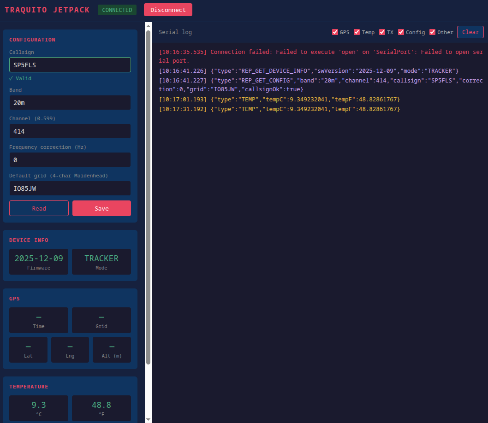

# About

This is the modification of [Traquito Jetpack WSPR tracker](https://traquito.github.io/tracker/) code. The code is experimental. 

Disclaimer: most of the original code modifications has been vibe-coded using claude code.

## About the original code

Source code for the [Traquito Jetpack WSPR tracker](https://traquito.github.io/tracker/) and [direct link](https://github.com/dmalnati/TraquitoJetpack/)

That (and this) project relies heavily on the [https://github.com/dmalnati/picoinf](https://github.com/dmalnati/picoinf) project.

# This fork

Summary of changes:
- no telemetry
- transmission every 2 minutes
- transmitting also when connected to USB/serial
- less verbose about GPS NMEA logs
- less frequent temperature reading (30 seconds)
- `config.html` local page to configure beacon via WebSerial


## Use pre-compiled binaries

Pre-compiled `.uf2` binaries are (will be) published *soon*.

To flash a `.uf2` file:
1. Hold **BOOTSEL** on the Pico while plugging in USB — it mounts as `RPI-RP2`.
2. Copy `TraquitoJetpack.uf2` to the drive. The device reboots automatically.

## How to compile

Requires `cmake`, `gcc-arm-none-eabi`, `libnewlib-arm-none-eabi`, and `build-essential`.

```bash
# Install toolchain (Debian/Ubuntu)
sudo apt install cmake gcc-arm-none-eabi libnewlib-arm-none-eabi build-essential

# Clone and initialise all submodules
git clone <repo-url>
cd TraquitoJetpack
git submodule update --init --recursive

# Build
mkdir build && cd build
cmake ..
make -j$(nproc)
```

Output: `build/src/TraquitoJetpack.uf2`

> **Note:** The `ext/picoinf` submodule contains local patches required for the Debian/Ubuntu toolchain. See the [Build fixes](#build-fixes-for-debianubuntu-gcc-arm-none-eabi-132) section below if you reset or update the submodule.

## Configuration

### Via `config.html` and web serial

Open `config.html` directly in Chrome or Edge (89+). Click **Connect**, select the Pico's USB serial port, then use the form to read or save configuration. The page also shows a live log of GPS fixes, temperature, and transmission events.

> [!TIP]
> Web Serial requires Chrome/Edge. Firefox is not supported ☹️




### Via serial

- open serial console `tio --map INLCRNL,ODELBS --timestamp -e -b 115200 /dev/ttyACM0`
- send config string, eg `{"type":"REQ_SET_CONFIG","band":"20m","channel":414,"callsign":"SP5FLS","correction":0,"grid":"IO85"}`


## Operational changes (beacon-only, 2-minute cycle)

The firmware has been modified from its original multi-slot telemetry design:

- **Telemetry removed** — only slot 1 (Type 1 Regular: callsign + grid + power) is transmitted. Slots 2–5 (basic telemetry, extended telemetry) are disabled.
- **2-minute cycle** — the scheduler window is aligned to every even UTC minute (standard WSPR period) rather than every 10 minutes. Lockout ends after slot 1 completes so the next window is scheduled immediately.
- **Fallback grid** — a default Maidenhead grid can be configured via `REQ_SET_CONFIG` (`"grid"` field). It is used for transmissions before a GPS 3D fix is acquired, and updated automatically in flash once a fix is obtained.
- **Raw NMEA suppressed** — `GPS_LINE` JSON messages (raw `$GP...` sentences) are no longer emitted in config mode. `GPS_FIX_TIME`, `GPS_FIX_2D`, and `GPS_FIX_3D` events are still sent.

**Config API additions:**

| Command | Description |
|---------|-------------|
| `REQ_SET_CONFIG` | Now accepts optional `"grid"` field (4-char Maidenhead, e.g. `"IO85"`) |
| `REQ_GET_CONFIG` | Now returns `"grid"` field |
| `REQ_DELETE_CONFIG` | Erases stored config from flash and resets to defaults. Use when flash write fails after a firmware upgrade that changed the config struct layout. |

**Files changed:**

| File | Change |
|------|--------|
| `src/Application.h` | Remove telemetry slots; always transmit Type 1 beacon; fall back to stored grid when no 3D fix; persist grid to flash on 3D fix; align window to minute 0 |
| `src/Configuration.h` | Add `grid` field and `gridStorage` to flash struct; expose via `REQ_SET_CONFIG`/`REQ_GET_CONFIG`; add `REQ_DELETE_CONFIG` handler |
| `src/CopilotControlScheduler.h` | Change window cycle from 10 min to 2 min; end lockout after period 1 instead of period 5 |
| `src/SubsystemGps.h` | Suppress raw NMEA `GPS_LINE` output in config mode |

## Build fixes for Debian/Ubuntu (gcc-arm-none-eabi 13.2)

The `ext/picoinf` submodule required local patches to build on a standard Debian/Ubuntu toolchain. These patches are not upstream. If you reset or update the submodule, reapply them.

**Root causes:**
- The packaged `gcc-arm-none-eabi` uses its own internal `stdint.h` rather than newlib's, so `__int64_t_defined` is never set, causing `PRIu64`/`SCNu*` macros from newlib's `inttypes.h` to be undefined even after `#include <cinttypes>`.
- JerryScript's heap size (default 512 KB) was not being overridden correctly due to CMake cache variable precedence, causing the firmware's BSS to overflow Pico RAM by ~348 KB.
- WsprEncoded unit tests were being compiled and cross-linked with the ARM toolchain (missing POSIX syscalls).
- `clock_handle_t` was renamed to `enum clock_index` in the pico-sdk version used here.
- `Time.h` was renamed to `TimeClass.h` in picoinf.

**Files changed:**

| File | Change |
|------|--------|
| `ext/picoinf/CMakeLists.txt` | Add `__STDC_FORMAT_MACROS` compile definition; use `CACHE STRING "" FORCE` for JerryScript heap/stack limits |
| `ext/picoinf/ext/WsprEncoded/CMakeLists.txt` | Suppress `-Werror=stringop-truncation`; skip `test/` subdirectory when not top-level project |
| `ext/picoinf/src/App/Log/Log.cpp` | Replace `PRIu64`/`PRId64` with `%llu`/`%lld` |
| `ext/picoinf/src/App/Utl/UtlString.h` | Add `#include <cstdint>` |
| `ext/picoinf/src/App/Utl/UtlString.cpp` | Replace `PRIu64` with `%llu` |
| `ext/picoinf/src/App/Service/TimeClass.cpp` | Replace `SCNu*` macros with `%u` and explicit casts |
| `ext/picoinf/src/App/Peripheral/Clock.cpp` | Replace `clock_handle_t` with `enum clock_index` |
| `src/Application.h` | `#include "Time.h"` → `#include "TimeClass.h"` |
