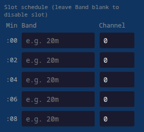

# About

This is a modification of the [Traquito Jetpack WSPR tracker](https://traquito.github.io/tracker/) firmware that turns the same low-cost jetpack hardware into a **mixed-mode HF ground-station beacon**. The code is experimental.

> [!WARNING]  
> To use this beacon (the hardware and firmware) to send messages, you need a valid amateur radio operator licence.

> [!NOTE]  
> Disclaimer: most of the code modifications have been vibe-coded using Claude Code.

## About the original code

Source code for the original [Traquito Jetpack WSPR tracker](https://traquito.github.io/tracker/) — [direct link](https://github.com/dmalnati/TraquitoJetpack/).

That (and this) project relies heavily on [picoinf](https://github.com/dmalnati/picoinf).

# This fork — summary of changes

- **Mixed-mode sequential slot scheduling** — configure an ordered list of up to 24 transmission slots. Each slot independently picks:
  - **WSPR-2** (2-minute window),
  - **WSPR-15** (15-minute window),
  - **CW** (fires immediately after the previous slot ends),
  - **IDLE** (waits N minutes, no transmission). Slots fire back-to-back; the scheduler computes the next valid UTC-aligned window for each slot's mode so a mixed schedule "just works".

List of the features include:

- **IDLE slot** — reserves a configurable wait (1–10080 minutes) on the schedule with no transmission and no radio/GPS activity. Useful for spacing cycles out (e.g. transmit, then go quiet for an hour) without the whole-cycle granularity of `txInterval`. Software-only — it does not put the microcontroller itself to sleep.
- **CW beacon mode** — CW slots auto-generate a K5RWK/B-style beacon message (`VVV DE {call}/B {grid} × 3`) for Reverse Beacon Network spotting. Per-slot frequency (Hz) and WPM are configurable. Fast Si5351 output-enable keying keeps transitions in ~50 µs.
- **Per-slot UTC alignment** — the scheduler always lands WSPR transmissions on the correct boundary for the slot's mode (even minutes for WSPR-2, multiples of 15 for WSPR-15). CW slots fire immediately with no alignment gap.
- **Configurable TX interval** — transmit every N cycles (1 = every cycle); a "cycle" is the full sequence of configured slots.
- **No JavaScript / no telemetry** — the JerryScript VM, per-slot JS, and user-defined telemetry messages have been removed. Only Type 1 Regular WSPR messages (callsign + 4-char grid + power dBm) and CW beacon are transmitted.
- **Ground-station orientation** — the device is no longer a balloon tracker. The Maidenhead grid is user-entered in configuration; it is **not** auto-overwritten from GPS 3D fixes. CW uses the full 6-char grid; WSPR uses the first 4 chars.
- **Transmits while USB/serial connected** — no need to disconnect for the scheduler to run.
- **Less verbose GPS output** — raw NMEA `GPS_LINE` messages suppressed; `GPS_FIX_TIME`, `GPS_FIX_2D`, `GPS_FIX_3D` events still emitted.
- **Less frequent temperature reading** — polled every 30 seconds instead of every second.
- **`config.html`** — local web page to configure the beacon over Web Serial (Chrome/Edge 89+).

## Use pre-compiled binaries (quick start)

Pre-compiled `.uf2` binaries are published in releases: <https://github.com/filipsPL/TraquitoBeacon/releases/>

To flash a `.uf2` file:

1. Hold **BOOTSEL** on the Pico while plugging in USB — it mounts as `RPI-RP2`.
2. Copy `TraquitoJetpack.uf2` to the drive. The device reboots automatically.

> **Note:** This firmware uses a different on-flash configuration layout than older releases. After flashing, send `{"type":"REQ_DELETE_CONFIG"}` via serial (or click **Erase flash config** in `config.html`) to clear stale data, then reconfigure.

## How to compile

Requires `cmake`, `gcc-arm-none-eabi`, `libnewlib-arm-none-eabi`, and `build-essential`.

```bash
# Install toolchain (Debian/Ubuntu)
sudo apt install cmake gcc-arm-none-eabi libnewlib-arm-none-eabi build-essential

# Clone and initialise all submodules
git clone <repo-url>
cd TraquitoJetpack
git submodule update --init --recursive

# Build
mkdir build && cd build
cmake ..
make -j$(nproc)
```

Output: `build/src/TraquitoJetpack.uf2`

> **Note:** The `ext/picoinf` submodule contains local patches required for the Debian/Ubuntu toolchain. See [Build fixes](#build-fixes-for-debianubuntu-gcc-arm-none-eabi-132) below if you reset or update the submodule. A patch file capturing all changes is at `ext/picoinf.patch` — apply with `git apply ../../ext/picoinf.patch` from inside `ext/picoinf/`.

## Configuration

### Via `config.html` and Web Serial

Open `config.html` directly in Chrome or Edge (89+). Click **Connect**, select the Pico's USB serial port, then use the form to read or save configuration. The page shows a live log of GPS fixes, temperature, and transmission events.

> [!TIP]
> Web Serial requires Chrome/Edge 89+. Firefox is not supported.


**Configuration fields:**

| Field                | Description                                                                                   |
| -------------------- | --------------------------------------------------------------------------------------------- |
| Callsign             | Amateur radio callsign (up to 6 characters)                                                   |
| Grid                 | Maidenhead locator, up to 6 chars (user-entered; not derived from GPS). WSPR uses first 4; CW beacon uses all 6. |
| Frequency correction | Signed Hz offset to compensate for Si5351 crystal error                                       |
| TX interval          | Number of cycles between active cycles (1 = every cycle)                                      |
| Slot schedule        | Ordered list of slots, each with its own mode (WSPR-2 / WSPR-15 / CW / IDLE), band, channel or frequency, and WPM (or idle duration for IDLE) |

**Slot schedule table** — each row is one transmission. The **Fires at** column previews the minute-within-cycle each slot will run, assuming the cycle starts at :00. Use the ↑↓ buttons to reorder slots and × to remove. The cycle length is shown beneath the table (the schedule repeats indefinitely, UTC-aligned).



### Via serial

Open a serial console:

```bash
tio --map INLCRNL,ODELBS --timestamp -e -b 115200 /dev/ttyACM0
```

Send JSON commands, e.g.:

```json
{
  "type":"REQ_SET_CONFIG",
  "callsign":"SP5FLS",
  "correction":0,
  "grid":"IO85XW",
  "txInterval":1,
  "slots":[
    {"mode":0,"band":"20m","channel":414},
    {"mode":0,"band":"10m","channel":414},
    {"mode":1,"band":"20m","channel":5},
    {"mode":2,"band":"20m","frequencyHz":14025000,"wpm":18},
    {"mode":3,"idleMinutes":30}
  ]
}
```

`mode`: `0` = WSPR-2, `1` = WSPR-15, `2` = CW, `3` = IDLE.

For CW slots: `frequencyHz` is the exact transmit frequency in Hz; `wpm` is the keying speed (5–40). `band` is informational only (used for hardware filter selection).

For WSPR slots: `channel` selects the sub-band frequency via `WsprChannelMap`; `frequencyHz` and `wpm` are ignored.

For IDLE slots: `idleMinutes` (1–10080) is how long the scheduler waits before the next slot; no transmission occurs and `band`/`channel`/`frequencyHz`/`wpm` are ignored. This is a software wait only — the MCU is not put to sleep.

## Operational details

### Scheduling

The scheduler is **sequential and mode-aware**. The user provides an ordered list of slots; the scheduler:

1. Waits for the next UTC window valid for slot 1's mode (even minute for WSPR-2, multiple of 15 for WSPR-15; immediate for CW/IDLE).
2. After slot N's transmission (or idle wait) ends, fires slot N+1 at the next valid UTC window for its mode — WSPR-to-WSPR may introduce a gap; CW/IDLE fire instantly.
3. When all slots have fired, the cycle ends. The next cycle starts at the next valid UTC alignment for slot 1's mode.

The radio is warmed up (~30 s) before each slot when there is enough idle time; it is powered off after each slot and again at cycle end.

The **TX interval** setting skips N−1 complete cycles between active cycles.

> **Open question / known nuance:** with very short cycles (e.g. 2 × WSPR-2 = 4 min total) `txInterval=15` effectively means "transmit once an hour" — the unit is *cycles*, not minutes.

### CW beacon

CW slots transmit the K5RWK/B-style beacon message:

```
VVV DE {call}/B {grid} {call}/B {grid} {call}/B {grid}
```

The message is auto-generated from the configured callsign and grid. At 18 WPM the full message takes approximately 20 seconds. CW Skimmer's optimal range is 15–40 WPM; the `/B` suffix puts spots in RBN's beacon-classified feed.

Recommended CW frequencies for RBN spotting:

| Band | Frequency (Hz) | Rationale |
|------|---------------|-----------|
| 30m  | 10 115 000    | CW-only band, best HF skimmer coverage |
| 20m  | 14 025 000    | Dense skimmer coverage in the CW DX window |
| 40m  | 7 025 000     | Strong evening skimmer coverage |

### Frequency

For WSPR slots, output frequency is derived from each slot's configured band and channel via `WsprChannelMap`. For CW slots, `frequencyHz` is used directly. The **frequency correction** field (Hz) is applied on top of both to compensate for Si5351 crystal inaccuracy.

### GPS and grid

- The device waits for a GPS time fix (UTC sync) before scheduling any transmissions. A 3D position fix is not required.
- GPS runs at startup and is shut off once a time fix (and optionally a 3D fix) is acquired. It is briefly re-enabled for a time-only resync whenever the last fix is more than 6 hours old, keeping WSPR window alignment within spec despite MCU crystal drift (~2–3 s/day unsynced).
- The Maidenhead grid used in transmissions is **always** the user-configured value in flash. GPS-derived position is logged but never overwrites the configured grid.

### Config API

| Command               | Description                                                                                                                    |
| --------------------- | ------------------------------------------------------------------------------------------------------------------------------ |
| `REQ_GET_CONFIG`      | Returns all configuration fields including the slot list                                                                       |
| `REQ_SET_CONFIG`      | Sets all configuration fields; the `slots` array fully replaces the prior list                                                 |
| `REQ_DELETE_CONFIG`   | Erases stored config from flash and resets to defaults. Required after firmware upgrades that change the config struct layout. |
| `REQ_GET_DEVICE_INFO` | Returns firmware version and current mode (`CONFIG` or `BEACON`)                                                               |
| `REQ_WSPR_SEND`       | One-shot test WSPR transmission: `{ band, channel, mode, callsign, grid, power }`                                              |
| `REQ_RADIO_POWER_ON`  | Enable TX load switch (Si5351 power)                                                                                           |
| `REQ_RADIO_POWER_OFF` | Disable TX load switch                                                                                                         |
| `REQ_RADIO_OUTPUT_ENABLE` | Enable TX + start RF output                                                                                               |
| `REQ_RADIO_OUTPUT_DISABLE` | Stop RF output                                                                                                           |
| `REQ_SET_CONFIG_TEMP` | Temporary calibration setup (not saved to flash): `{ band, channel, correction }`                                             |
| `REQ_GPS_RESET`       | Send GPS reset command: `{ temp: "hot" \| "warm" \| "cold" }`                                                                |
| `REQ_GPS_POWER_ON`    | Power on GPS module                                                                                                            |
| `REQ_GPS_POWER_OFF`   | Power off GPS module (battery remains on)                                                                                      |
| `REQ_GPS_POWER_OFF`   | Power off GPS module including battery backup                                                                                  |

## Build fixes for Debian/Ubuntu (gcc-arm-none-eabi 13.2)

The `ext/picoinf` submodule required local patches to build on a standard Debian/Ubuntu toolchain. These patches are not upstream — reapply them if you reset or update the submodule. The full patch is committed to the repo as `ext/picoinf.patch`.

**Root causes:**

- The packaged `gcc-arm-none-eabi` uses its own internal `stdint.h` rather than newlib's, so `__int64_t_defined` is never set, causing `PRIu64`/`SCNu*` macros from newlib's `inttypes.h` to be undefined even after `#include <cinttypes>`.
- WsprEncoded unit tests were being compiled and cross-linked with the ARM toolchain (missing POSIX syscalls).
- `clock_handle_t` was renamed to `enum clock_index` in the pico-sdk version used here.
- `Time.h` was renamed to `TimeClass.h` in picoinf.

**Files patched:**

| File                                         | Change                                                                                                       |
| -------------------------------------------- | ------------------------------------------------------------------------------------------------------------ |
| `ext/picoinf/CMakeLists.txt`                 | Add `__STDC_FORMAT_MACROS` compile definition                                                                |
| `ext/picoinf/ext/WsprEncoded/CMakeLists.txt` | Suppress `-Werror=stringop-truncation`; skip `test/` subdirectory when not top-level project                 |
| `ext/picoinf/src/App/Log/Log.cpp`            | Replace `PRIu64`/`PRId64` with `%llu`/`%lld`                                                                 |
| `ext/picoinf/src/App/Utl/UtlString.h`        | Add `#include <cstdint>`                                                                                     |
| `ext/picoinf/src/App/Utl/UtlString.cpp`      | Replace `PRIu64` with `%llu`                                                                                 |
| `ext/picoinf/src/App/Service/TimeClass.cpp`  | Replace `SCNu*` macros with `%u` and explicit casts                                                          |
| `ext/picoinf/src/App/Peripheral/Clock.cpp`   | Replace `clock_handle_t` with `enum clock_index`                                                             |
| `ext/picoinf/src/WSPR/WSPRMessageTransmitter.h` | Add `void Key(bool on)` for fast CW keying via output_enable toggle                                      |
