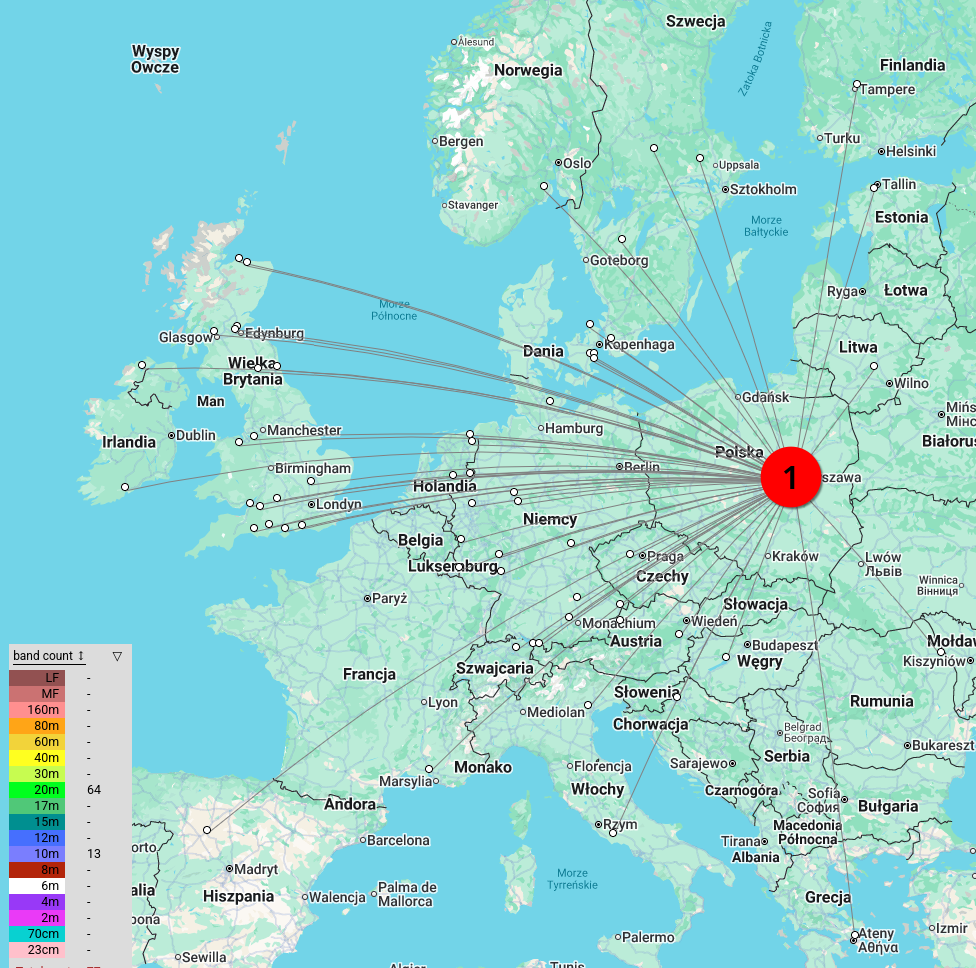
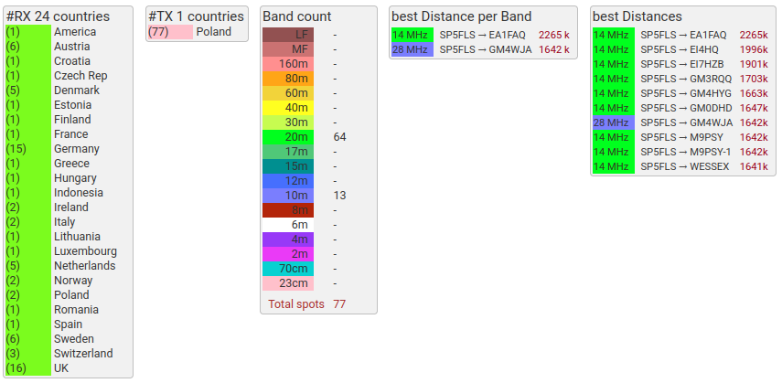

# About

This is a modification of the [Traquito Jetpack WSPR tracker](https://traquito.github.io/tracker/) firmware to use the same, low cost jetpack hardware but use it as a regular WSPR beacon. The code is experimental.

> [!CAUTION]
> This tool (hardware + software) is for amateur radio operators holding an amateur radio licence.

Disclaimer: most of the original code modifications have been vibe-coded using Claude Code.

## About the original code

Source code for the [Traquito Jetpack WSPR tracker](https://traquito.github.io/tracker/) — [direct link](https://github.com/dmalnati/TraquitoJetpack/).

That (and this) project relies heavily on [picoinf](https://github.com/dmalnati/picoinf).

# This fork — summary of changes

- **Multi-band slot scheduling** — 10-minute cycle with 5 independently configurable slots (minutes :00, :02, :04, :06, :08), each with its own band and channel. Leave a slot's band blank to disable it.
- **Configurable TX interval** — transmit every N cycles (default 1 = every 10 minutes when using all slots, every 2 minutes when only slot 1 is used).
- **Transmits while USB/serial connected** — no need to disconnect for the scheduler to run.
- **No telemetry** — only Type 1 Regular WSPR messages (callsign + 4-char grid + power dBm).
- **One-shot GPS** — on power-on the GPS runs until it acquires a time fix (required to align to WSPR windows) and optionally a 3D position fix (to update the grid locator). After that GPS is permanently shut off; it is never re-enabled during subsequent cycles. The radio runs continuously across all slots with no mid-cycle stop.
- **Fallback grid** — if no 3D fix is obtained before the first transmission, the last-known grid from flash (or the configured default grid) is used for all subsequent transmissions.
- **Less verbose GPS output** — raw NMEA `GPS_LINE` messages suppressed; `GPS_FIX_TIME`, `GPS_FIX_2D`, `GPS_FIX_3D` events still emitted.
- **Less frequent temperature reading** — polled every 30 seconds instead of every second.
- **`config.html`** — local web page to configure the beacon over WebSerial (Chrome/Edge 89+).

## Effects

24h stats from wspr.rocks for traquitto beacon with 2x5m wire antenna in the urban settings. Works really well (@ 0.02W)!

| wspr.rocks map | statistics |
| ---- | ---- |
|  |  |


## Use pre-compiled binaries

Pre-compiled `.uf2` binaries are published in releases: <https://github.com/filipsPL/TraquitoBeacon/releases/>

To flash a `.uf2` file:

1. Hold **BOOTSEL** on the Pico while plugging in USB — it mounts as `RPI-RP2`.
2. Copy `TraquitoJetpack.uf2` to the drive. The device reboots automatically.

> **Note:** After flashing firmware that changes the configuration struct layout, send `{"type":"REQ_DELETE_CONFIG"}` via serial to erase stale flash data, then reconfigure.

## How to compile

Requires `cmake`, `gcc-arm-none-eabi`, `libnewlib-arm-none-eabi`, and `build-essential`.

```bash
# Install toolchain (Debian/Ubuntu)
sudo apt install cmake gcc-arm-none-eabi libnewlib-arm-none-eabi build-essential

# Clone and initialise all submodules
git clone <repo-url>
cd TraquitoJetpack
git submodule update --init --recursive

# Build
mkdir build && cd build
cmake ..
make -j$(nproc)
```

Output: `build/src/TraquitoJetpack.uf2`

> **Note:** The build produces a harmless linker error for the standalone `jerry.elf` host binary (a JerryScript test tool). The firmware target `TraquitoJetpack` builds successfully regardless.

> **Note:** The `ext/picoinf` submodule contains local patches required for the Debian/Ubuntu toolchain. See [Build fixes](#build-fixes-for-debianubuntu-gcc-arm-none-eabi-132) below if you reset or update the submodule.

## Configuration

### Via `config.html` and Web Serial

Open `config.html` directly in Chrome or Edge (89+). Click **Connect**, select the Pico's USB serial port, then use the form to read or save configuration. The page shows a live log of GPS fixes, temperature, and transmission events.

> [!TIP]
> Web Serial requires Chrome/Edge 89+. Firefox is not supported.


**Configuration fields:**

| Field                | Description                                                   |
| -------------------- | ------------------------------------------------------------- |
| Callsign             | Amateur radio callsign (up to 6 characters)                   |
| Band                 | Primary/fallback band (e.g. `20m`)                            |
| Channel              | Primary/fallback channel (0–599)                              |
| Frequency correction | Signed Hz offset to compensate for Si5351 crystal error       |
| Default grid         | 4-char Maidenhead locator used before GPS 3D fix              |
| TX interval          | Number of 10-minute cycles between transmissions (default 1)  |
| Slot schedule        | Per-slot band + channel for each 2-minute window in the cycle |

**Slot schedule table** — each row corresponds to one 2-minute WSPR window within the 10-minute cycle. Leave the Band field blank to disable a slot (no transmission that window).


### Via serial

Open a serial console:

```bash
tio --map INLCRNL,ODELBS --timestamp -e -b 115200 /dev/ttyACM0
```

Send JSON commands, e.g.:

```json
{"type":"REQ_SET_CONFIG","callsign":"SP5FLS","band":"20m","channel":414,"correction":0,"grid":"IO85","txInterval":1,"slotBands":["20m","10m","","",""],"slotChannels":[414,0,0,0,0]}
```

## Operational details

### Scheduling

The scheduler operates on a 10-minute cycle aligned to even UTC minutes (standard WSPR windows). Within each cycle there are 5 slots:

| Slot | UTC minute offset | Configurable |
| ---- | ----------------- | ------------ |
| 1    | :00               | Yes          |
| 2    | :02               | Yes          |
| 3    | :04               | Yes          |
| 4    | :06               | Yes          |
| 5    | :08               | Yes          |

Each slot has its own band and channel. The radio frequency is switched at the start of each slot period. Disabled slots (empty band) are silently skipped — the timer fires but no transmission occurs.

The **TX interval** setting skips N−1 complete 10-minute cycles between active cycles. At interval=1 every cycle transmits; at interval=2 every other cycle transmits, etc.

### Frequency

Output frequency is derived entirely from the configured band and channel via `WsprChannelMap`. The **frequency correction** field (Hz) is applied on top to compensate for Si5351 crystal inaccuracy. No frequencies are hardcoded in this repository.

### GPS and grid

- The device waits for a GPS time fix (UTC sync) before scheduling any transmissions. A 3D position fix is not required.
- GPS runs once at startup only. Once a time fix (and optionally a 3D fix) is acquired, GPS is shut off permanently for the remainder of the session.
- If a 3D fix is obtained, the 4-char Maidenhead grid is updated and persisted to flash before the first transmission.
- If no 3D fix is obtained before the first transmission, the last-known grid from flash (or the configured default grid) is used for all transmissions.
- The radio runs continuously across all 5 slots within a cycle with no mid-cycle power-off.

### Config API

| Command               | Description                                                                                                                    |
| --------------------- | ------------------------------------------------------------------------------------------------------------------------------ |
| `REQ_GET_CONFIG`      | Returns all configuration fields including per-slot arrays                                                                     |
| `REQ_SET_CONFIG`      | Sets all configuration fields; per-slot `slotBands[]` and `slotChannels[]` are optional (existing values kept if omitted)      |
| `REQ_DELETE_CONFIG`   | Erases stored config from flash and resets to defaults. Required after firmware upgrades that change the config struct layout. |
| `REQ_GET_DEVICE_INFO` | Returns firmware version and current mode                                                                                      |

## Build fixes for Debian/Ubuntu (gcc-arm-none-eabi 13.2)

The `ext/picoinf` submodule required local patches to build on a standard Debian/Ubuntu toolchain. These patches are not upstream — reapply them if you reset or update the submodule.

**Root causes:**

- The packaged `gcc-arm-none-eabi` uses its own internal `stdint.h` rather than newlib's, so `__int64_t_defined` is never set, causing `PRIu64`/`SCNu*` macros from newlib's `inttypes.h` to be undefined even after `#include <cinttypes>`.
- JerryScript's heap size (default 512 KB) was not being overridden correctly due to CMake cache variable precedence, causing the firmware's BSS to overflow Pico RAM by ~348 KB.
- WsprEncoded unit tests were being compiled and cross-linked with the ARM toolchain (missing POSIX syscalls).
- `clock_handle_t` was renamed to `enum clock_index` in the pico-sdk version used here.
- `Time.h` was renamed to `TimeClass.h` in picoinf.

**Files patched:**

| File                                         | Change                                                                                                       |
| -------------------------------------------- | ------------------------------------------------------------------------------------------------------------ |
| `ext/picoinf/CMakeLists.txt`                 | Add `__STDC_FORMAT_MACROS` compile definition; use `CACHE STRING "" FORCE` for JerryScript heap/stack limits |
| `ext/picoinf/ext/WsprEncoded/CMakeLists.txt` | Suppress `-Werror=stringop-truncation`; skip `test/` subdirectory when not top-level project                 |
| `ext/picoinf/src/App/Log/Log.cpp`            | Replace `PRIu64`/`PRId64` with `%llu`/`%lld`                                                                 |
| `ext/picoinf/src/App/Utl/UtlString.h`        | Add `#include <cstdint>`                                                                                     |
| `ext/picoinf/src/App/Utl/UtlString.cpp`      | Replace `PRIu64` with `%llu`                                                                                 |
| `ext/picoinf/src/App/Service/TimeClass.cpp`  | Replace `SCNu*` macros with `%u` and explicit casts                                                          |
| `ext/picoinf/src/App/Peripheral/Clock.cpp`   | Replace `clock_handle_t` with `enum clock_index`                                                             |
| `src/Application.h`                          | `#include "Time.h"` → `#include "TimeClass.h"`                                                               |
